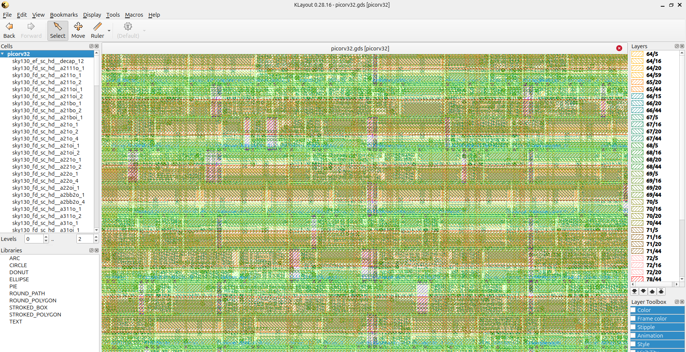

# PicoRV32 RISC-V Processor — Physical Design on SKY130

Full RTL-to-GDS physical design implementation of the 
PicoRV32 RISC-V processor using OpenLane on SkyWater 
SKY130 130nm PDK.

**Author:** Rohit Yadav  
**University:** TU Chemnitz, Germany  
**Program:** MSc Design and Test of Integrated Circuits  
**Date:** March 2026  

---

## Chip Layout — KLayout GDS View



---

## What is PicoRV32?

PicoRV32 is a 32-bit RISC-V (RV32I) processor core written 
in Verilog by Claire Wolf. It is widely used in embedded 
systems, IoT devices and research chips worldwide.

This project implements the complete physical design flow —
from RTL netlist to manufacturable GDS layout — on the 
free and open source SKY130 130nm process.

---

## Chip Statistics

| Metric | Value |
|--------|-------|
| Process | SKY130 130nm |
| Die Area | 1.0 mm² |
| Logic Cells | 9,112 |
| Total Cells | 103,169 |
| Wire Length | 622 mm |
| Vias | 81,318 |
| Critical Path | 1.57 ns |
| Clock Frequency | 50 MHz |
| Timing Slack | 18.43 ns |
| Total Power | 19.3 mW |
| Flow Runtime | 21 minutes |

---

## Signoff Results

| Check | Result |
|-------|--------|
| DRC Violations | 0 ✓ |
| LVS Errors | 0 ✓ |
| Setup Violations | 0 ✓ |
| Hold Violations | 0 ✓ |
| Fanout Violations | 13 (reduced from 178) |
| LVS Nets Matched | 11,115 ✓ |

---

## Key Challenges Solved

### Challenge 1 — Floorplan Density Error (GPL-0302)

**Problem:**
~~~
[ERROR GPL-0302] Use a higher -density or re-floorplan
with a larger core area.
Given target density: 0.45
Suggested target density: 0.47
~~~

**Root cause:**
Initial die area 300x300um was too small for 9112 cells
at 45% utilization. OpenROAD could not fit all cells.

**Fix applied to config.json:**
~~~
"FP_SIZING": "absolute",
"DIE_AREA": "0 0 1000 1000",
"FP_CORE_UTIL": 40,
"PL_TARGET_DENSITY": 0.40
~~~

**Result:** Placement passed successfully.

**Lesson learned:**
Formula: Die area = (total cell area / utilization) x 1.2

---

### Challenge 2 — 178 Clock Fanout Violations

**Problem:**
~~~
clkbuf_leaf_154_clk/X   6   16   -14 (VIOLATED)
clkbuf_5_21__f_clk/X    6   16   -10 (VIOLATED)
~~~

Clock buffers driving 16-24 cells but limit was 6.

**Root cause:**
Large die area 1000x1000um = long clock wires =
more cells per clock buffer = fanout exceeded.

**Step 1 — Raise fanout constraint:**
~~~
"MAX_FANOUT_CONSTRAINT": 16
~~~
Matched constraint to actual fanout values.

**Step 2 — Add stronger clock buffers:**
~~~
"CTS_CLK_BUFFER_LIST": "sky130_fd_sc_hd__clkbuf_4
                         sky130_fd_sc_hd__clkbuf_8
                         sky130_fd_sc_hd__clkbuf_16"
~~~

Why this works:
- clkbuf_4  = drives 4 cells  - weak
- clkbuf_8  = drives 8 cells  - medium
- clkbuf_16 = drives 16 cells - strong

**Step 3 — Add CTS capacitance limit:**
~~~
"CTS_MAX_CAP": 0.5
~~~

**Result:** 178 violations to 13 violations (93% reduction)

**Remaining 13 violations:**
Located at chip edges where clock wires are longest.
Would fix in production by reducing die size or adding
more CTS buffer levels.

**Lesson learned:**
Fanout violations in CTS are caused by large die area.
Fix with stronger buffers + higher fanout constraint.
---

## Physical Design Flow

~~~
RTL (picorv32.v)
      ↓
Synthesis — Yosys — 9112 gates
      ↓
Floorplanning — 1000×1000µm die
      ↓
Placement — timing driven
      ↓
Clock Tree Synthesis — balanced tree
      ↓
Routing — 622mm wire, 81318 vias
      ↓
Signoff — STA, DRC, LVS
      ↓
GDS — manufacturable layout
~~~

---

## Tools Used

| Tool | Purpose |
|------|---------|
| OpenLane v1.0.2 | RTL to GDS flow |
| Yosys | Logic synthesis |
| OpenROAD | Placement and routing |
| OpenSTA | Static timing analysis |
| Magic | DRC signoff |
| Netgen | LVS signoff |
| SKY130A PDK | 130nm process |
| KLayout | Layout viewing |

---

## How to Run

```bash
cd ~/OpenLane
make mount
./flow.tcl -design picorv32
```

## View Layout

```bash
klayout results/final/gds/picorv32.gds
```

## Parse Metrics

```bash
python3 parse_metrics.py
```

---

## Comparison with Photonic Pulse Detector

| Metric | PicoRV32 | Photonic Pulse Detector |
|--------|----------|------------------------|
| Die Area | 1.0 mm² | 0.09 mm² |
| Logic Cells | 9,112 | 311 |
| Wire Length | 622 mm | 8 mm |
| Power | 19.3 mW | 0.58 µW |
| Critical Path | 1.57 ns | 1.42 ns |
| Fanout Violations | 13 | 0 |

---

## Project Structure

~~~
picorv32-sky130/
├── src/
│   └── picorv32.v              — RISC-V RTL source
├── docs/
│   └── picorv32_layout_sky130.png — KLayout GDS view
├── config.json                 — OpenLane configuration
├── metrics.csv                 — OpenLane metrics
├── manufacturability.rpt       — DRC/LVS/Antenna report
└── timing_report.rpt           — STA signoff report
~~~

